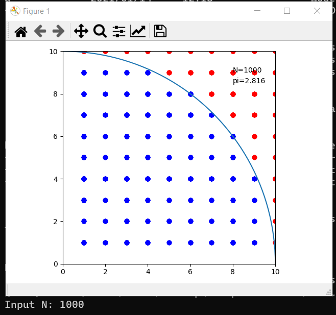

# MonteCarlo法によるπの概算

MonteCarlo法を用いてπの近似値を計算します。

# Requriements
- Python 3.8 or later
- Numpy
- Matplotlib

# Usage
`python MonteCarlo.py`を実行するとNの値を要求されるので、適当な自然数を入力して`Enter`

# Example
このようなウィンドウが表示される

